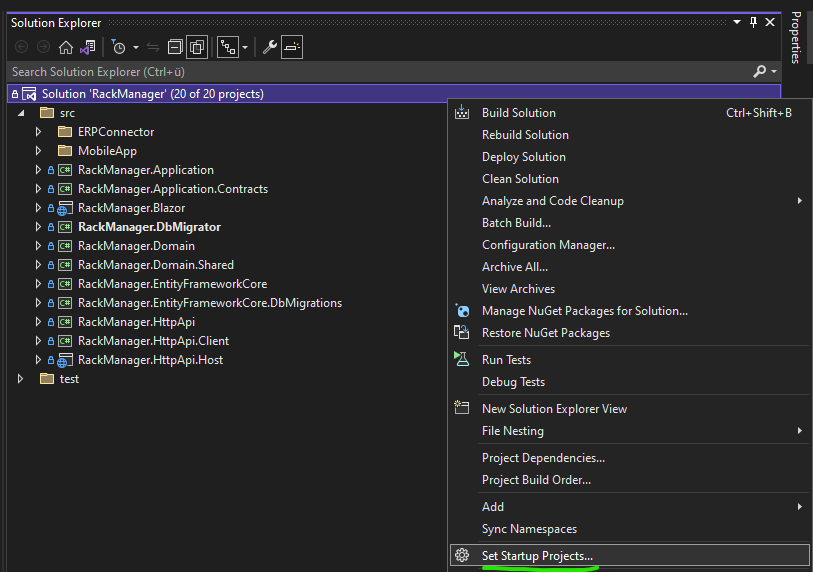
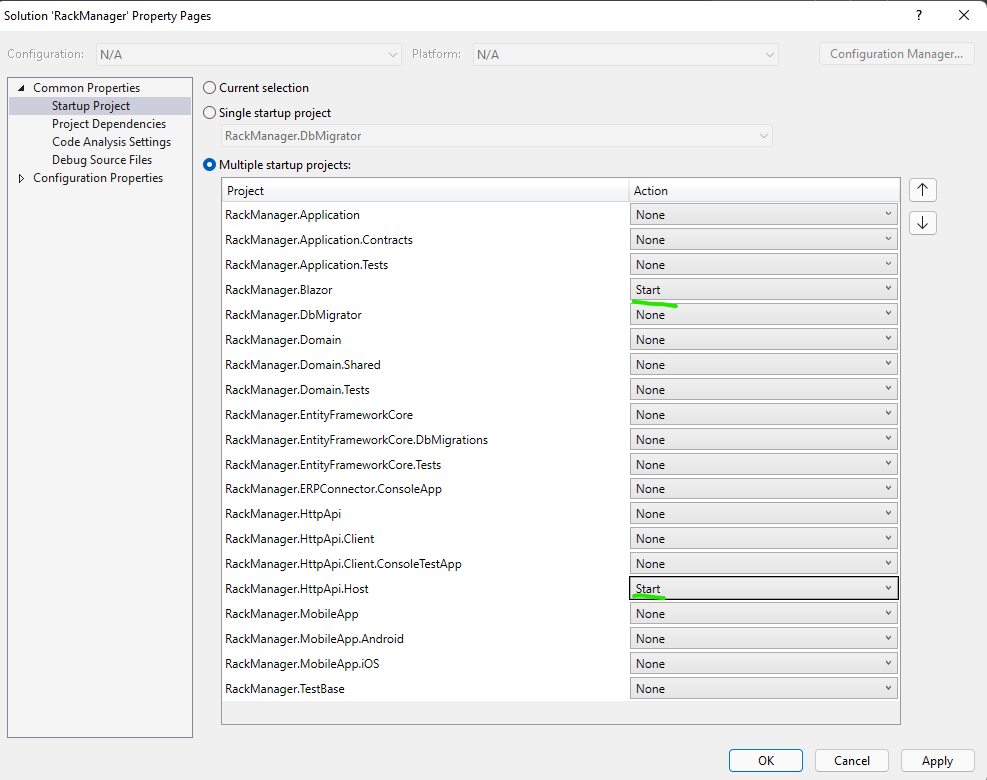
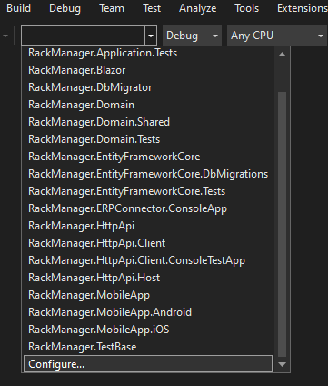
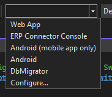

# Using Switch Startup Project Extension

In this article, I want to show how I use the [Switch Startup Project Extension](https://heptapod.host/thirteen/switchstartupproject/-/tree/branch/current) to make development of an ABP Framework application a little bit faster.

> I am not the developer of the extension.

## Problem and assumptions made
When developing an ABP Framework application, you'll often have to start and debug multiple projects at once. 

Let's assume you haven't set up containerization/ orchestration and you have a setup where your stack is somehow tiered (like blazor wasm, where you have to start the WebAssembly Project and the HttpApi.Host at once).

Normally you would do something like this:





And every time you need to execute something different, you change your startup projects accordingly.

## How the extension tackles this
With the extenmsion installed, you can simplify this process.

Configure the extension for your project by clicking this button:



A new window will open with a json file, where you can set everything as you need.

```json
/*
    This is a configuration file for the SwitchStartupProject Visual Studio Extension
    See https://heptapod.host/thirteen/switchstartupproject/blob/branch/current/Configuration.md
*/
{
  /*  Configuration File Version  */
  "Version": 3,
    
  /*  Create an item in the dropdown list for each project in the solution?  */
  "ListAllProjects": false,

  "MultiProjectConfigurations": {
    "Web App": {
      "Projects": {
        "RackManager.HttpApi.Host": {},
        "RackManager.Blazor": {}
      }
    },
    "ERP Connector Console": {
      "Projects": {
        "RackManager.HttpApi.Host": {},
        "RackManager.ERPConnector.ConsoleApp": {}
      }
    },
    "Android (mobile app only)": {
      "Projects": {
        "RackManager.MobileApp.Android": {}
      }
    },
    "Android": {
      "Projects": {
        "RackManager.HttpApi.Host": {},
        "RackManager.MobileApp.Android": {}
      }
    },
    "DbMigrator": {
      "Projects": {
        "RackManager.DbMigrator": {}
      }
    }
  }
}

```

The process is self explaining. You'll end up with a configuration file which is valid for your current solution. You can add it to your source control to allow every consumer to have the same experience (as long as they have this extension installed).

And that's it. You can now pick what you need from the dropdown without ever having to think about setting things up again.


